## HTB Writeup  :::: [OpenAdmin](https://www.hackthebox.eu/home/machines/profile/222)


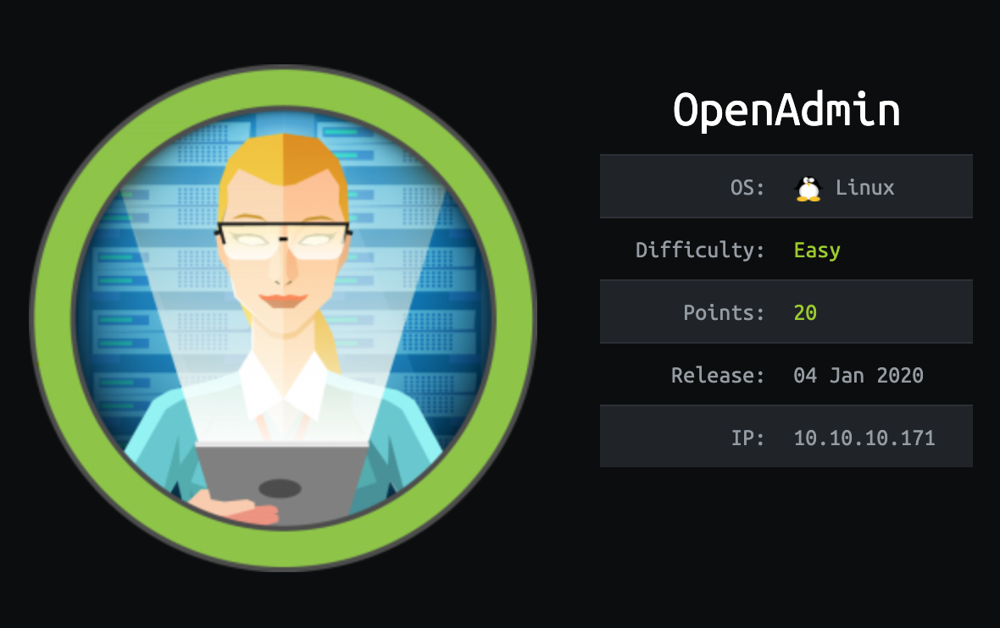


Primeiramente, você deve verificar/varrer as portas/serviços rodando nesse host. Para fazer isto você pode usar o nmap como no exemplo abaixo.


``` 
❯ nmap -sC -sV -T5 10.10.10.171
Starting Nmap 7.80 ( https://nmap.org ) at 2020-05-09 14:12 -03
Warning: 10.10.10.171 giving up on port because retransmission cap hit (2).
Nmap scan report for 10.10.10.171
Host is up (0.16s latency).
Not shown: 976 closed ports
PORT      STATE    SERVICE          VERSION
1/tcp     filtered tcpmux
22/tcp    open     ssh              OpenSSH 7.6p1 Ubuntu 4ubuntu0.3 (Ubuntu Linux; protocol 2.0)
| ssh-hostkey: 
|   2048 4b:98:df:85:d1:7e:f0:3d:da:48:cd:bc:92:00:b7:54 (RSA)
|   256 dc:eb:3d:c9:44:d1:18:b1:22:b4:cf:de:bd:6c:7a:54 (ECDSA)
|_  256 dc:ad:ca:3c:11:31:5b:6f:e6:a4:89:34:7c:9b:e5:50 (ED25519)
33/tcp    filtered dsp
80/tcp    open     http             Apache httpd 2.4.29 ((Ubuntu))
|_http-server-header: Apache/2.4.29 (Ubuntu)
|_http-title: Apache2 Ubuntu Default Page: It works

```


Segundo a nossa varredura de portas, esse host possui a porta 80 aberta, verificando a mesma no navegador, vemos que há um serviço apache rodando.


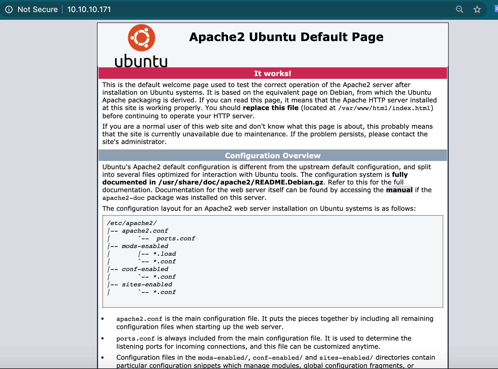


Okay, here we go... Vamos agora atrás de diretórios usando o dirb (você pode usar outros como gobuster, dirsearch).

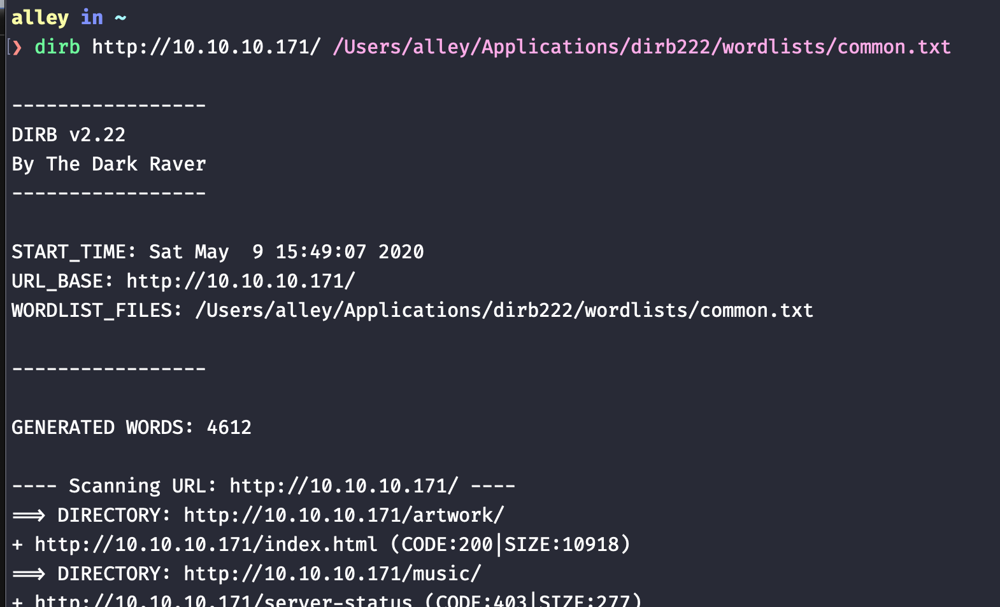

Veja só... Encontramos algumas coisas, veja o diretório music, ao clicar em login, ele nos redireciona para um diretório chamado ```ona```, ao verificar o mesmo 


Se clicarmos onde diz DOWNLOAD encontraremos o site oficial do OpenNetAdmin. Como podemos ver, o número da versão que ele possui é ```v18.1.1```.

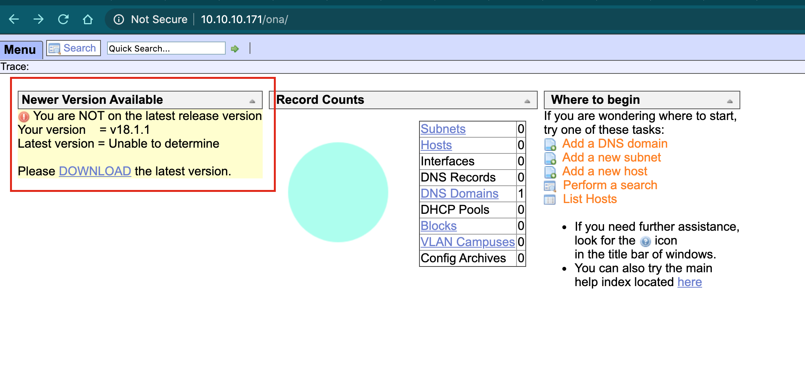

O OpenNetAdmin é um sistema de gerenciamento de endereço IP (IPAM) de código aberto e provavelmente está com uma versão vulnerável. Se pesquisarmos no Google ```opennetadmin v18.1.1 exploit``` acharemos vários exploits que poderão nos ajudar e provavelmente também usando o ```msfconsole```. Porém eu optei agora por usar um [exploit que encontrei no github.](https://github.com/amriunix/ona-rce)


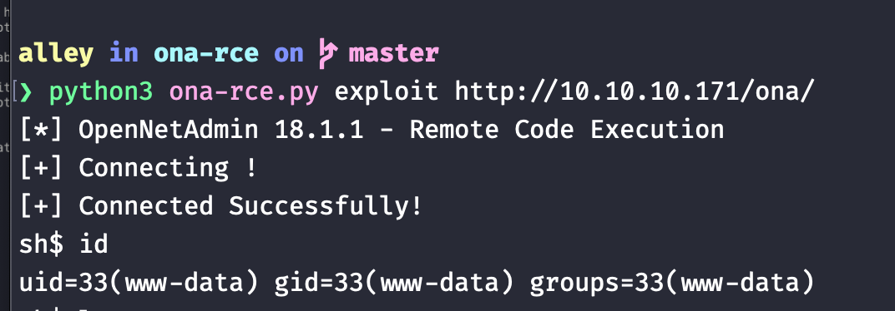
<sup>Okay... Conseguimos uma shell. Here we go!!</sup>

Vemos que há alguns diretórios, porém em vez de sair procurando, eu resolvi procurar por informações confidenciais como passwd, senha... Usando o ```grep -nri``` e eu recebi a senha de um usuário, ele me retornou algumas informações de banco e lá estava a senha. yeeah! 🌚

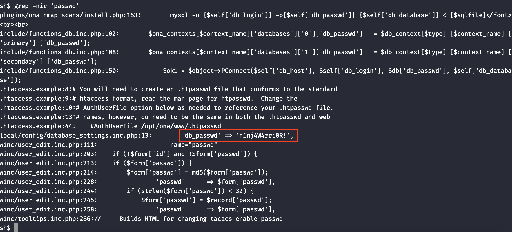

Só que eu não sabia qual era o usuário... Vish. Então eu dei um dir na home e me apareceram 2.

```
sh$ dir /home
jimmy  joanna
```

Tentei logar via ssh com o user jimmy e a senha que encontramos, e... DEU CERTO. 🥳

Depois de logar com o jimmy, fui no diretorio ``` /var/www/``` e encontrei alguns arquivos, um deles era o ```main.php```, e parece que há uma chave RSA em algum lugar... Então, eu executo o comando ```netstat -tupln``` para ver todos os endereços e portas locais, e vi um processo rodando na ```52846```

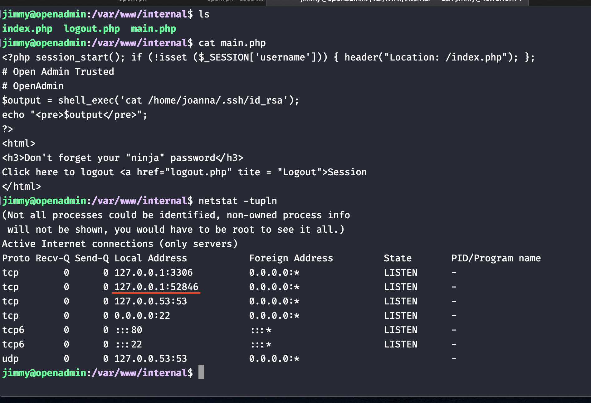

Vamos tentar fazer uma requisição nessa porta...

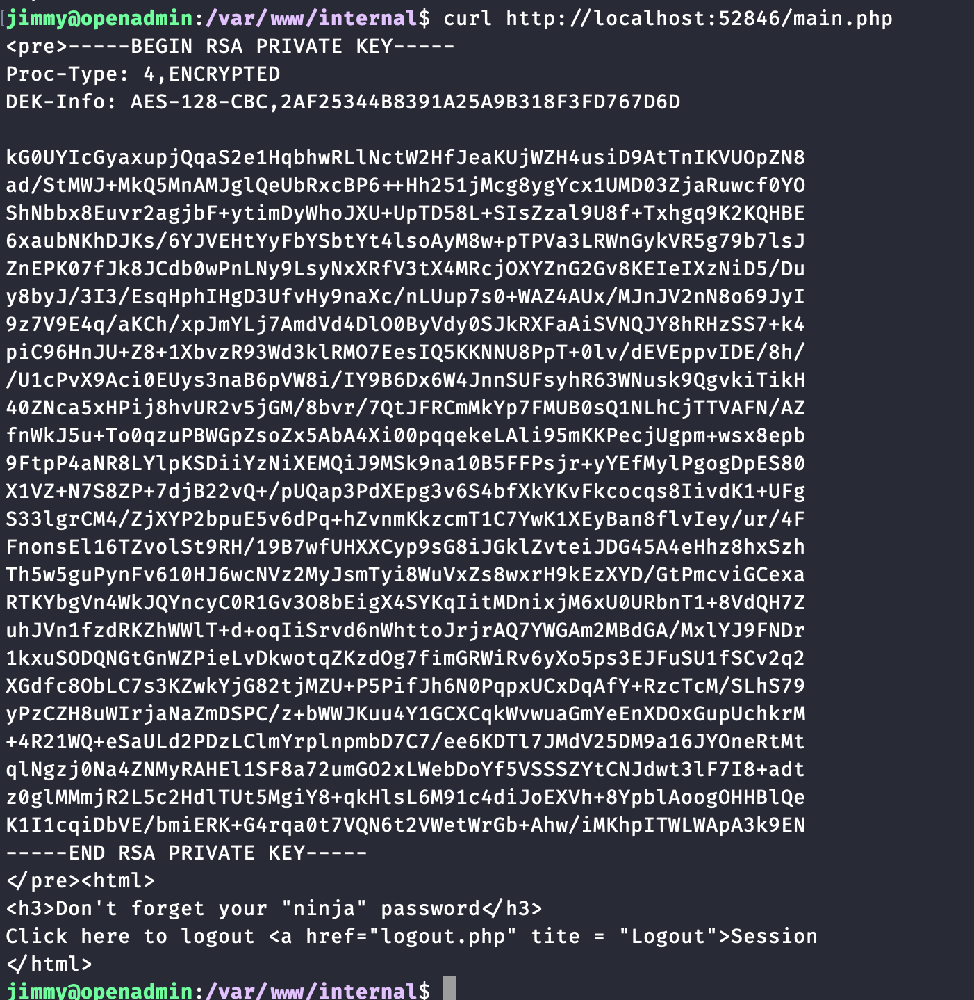

Olha só... Temos uma chave... Vamos tentar quebrá-la com o john, veja um exemplo abaixo de como usar. 

```
python /usr/share/john/ssh2john.py joana_rsa > joanna_rsa.hash
```
Hey, obtivemos a chave ```bloodninjas (joanna_rsa) ``` . Mas, essa senha não é para logar via ssh com o usuário joanna, e sim a senha de autenticação da chave privada ao usar a chave para conectar-se ao ssh. Precisamos definir a permissão de arquivo chmod da chave privada como 700 antes de conectar.

>  <sup>Caso esteja dando senha inválida, deve-se limpar o arquivo rsa, tirando o```<pre>```no inicio do arquivo, e o HTML final arquivo joanna_rsa, abra no nano (ou vim) e exclua-os.</sup> 


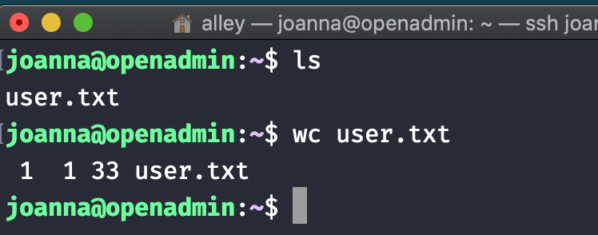

<sup>Conseguimos a primeira flag, agora falta o root. Here we go again...</sup>


####Root the Machine 

Como me é de costume, dei um ```sudo -l``` . 

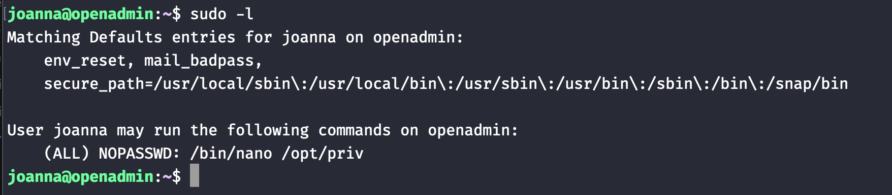

O comando mostra que o usuário Joanna pode executar como usuário root ```/bin/nano /opt/priv``` sem inserir uma senha. Então executamos o ```sudo /bin/nano /opt/priv``` sem senha e em seguida, podemos modificar o ```/etc/sudoers``` para obter o shell root.

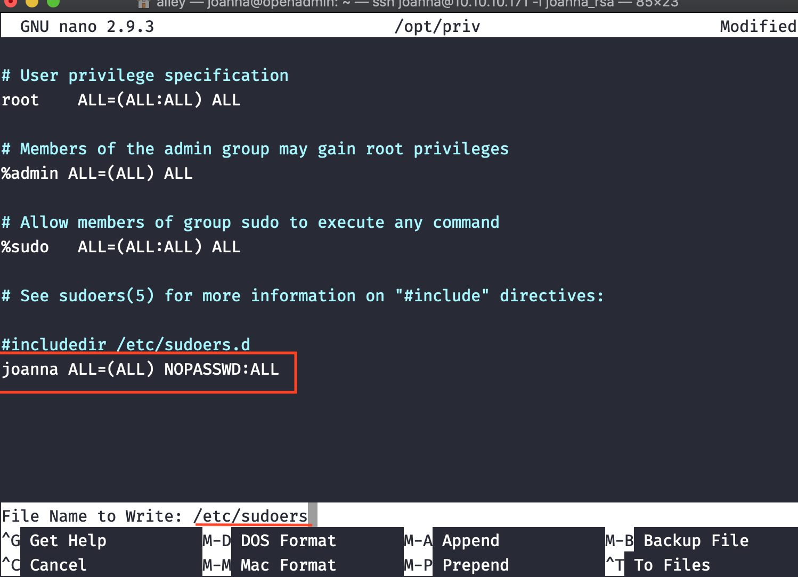

Depois disso, show me the root ```sudo -i``` 

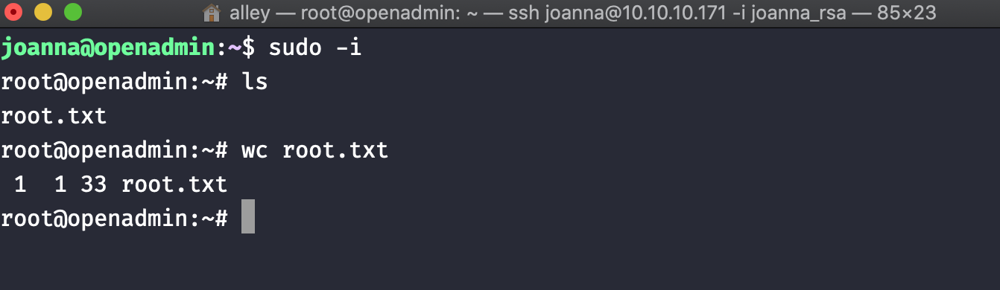


Done!!! 🖖🏼


Este é o meu [perfil no hackthebox](https://www.hackthebox.eu/home/users/profile/63790). 
Ando parada temporariamente com as máquinas mas voltarei em breve. 


